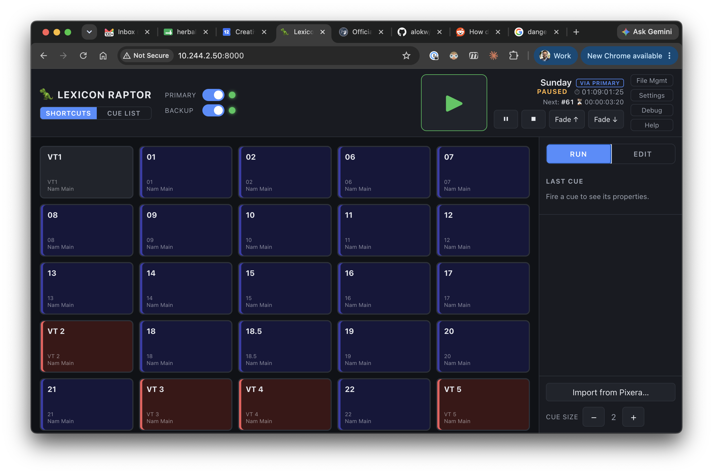
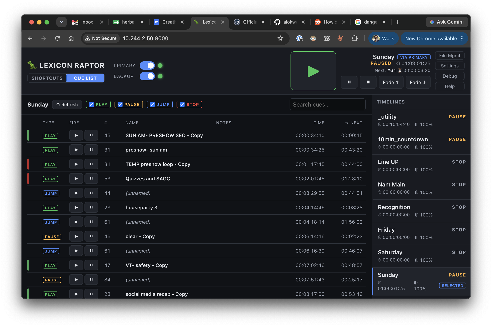

# Lexicon Raptor 🦖

A lightweight, Docker-deployable web dashboard for controlling **primary + backup Pixera media servers** during live events. Build a cuelist of big, touch-friendly GO buttons that fire cues by name on both machines simultaneously — or drive full timelines cue-by-cue from the Cue List view.

> **Why "Lexicon Raptor"?** It's an anagram of **"Pixera Control"**. 🦖

## Quick start (Docker)

```bash
docker compose up -d --build
```

Open **http://localhost:8000**. Show files are stored in `./data/` (the active one defaults to `show.json`).

### Pixera setup

In Pixera: **Settings → API**, set an access port to mode **JSON/TCP** (default port `1400`), then restart Pixera. Do this on both the primary and backup machines. Enter each machine's IP under **Settings** in the dashboard and flip its toggle on in the header — the dot turns green when connected.

## Quick start (local dev, no Docker)

```bash
npm install                # server deps
npm --prefix web install   # web deps
npm run mock &             # optional: fake Pixera on :1400 (use IP 127.0.0.1)
npm start &                # backend on :8000
npm run dev:web            # Vite dev server on :5173 (proxies to :8000)
```

For a production-style run without Docker: `npm run build:web && npm start` and open :8000.

## How it works

```
Browser UI  ←HTTP/WS→  Node backend  ←TCP (pxr1-framed JSON-RPC)→  Pixera primary
                            └────────←TCP────────────────────────→  Pixera backup
```

- **The backend holds persistent TCP connections** to both servers with auto-reconnect, heartbeats (dead-socket detection), and per-request timeouts.
- **Control commands fan out to every enabled+connected server.** Cues are fired *by timeline/cue name* (`Pixera.Compound.applyCueOnTimeline`), never by handle — handles differ between primary and backup, names don't. Firing succeeds if at least one server accepts. (The Cue List view's fade-to-cue is the one handle-based action; each server resolves its *own* handle by name at fire time, and handles are never persisted.)
- **Feedback** — selected timeline, transport, elapsed, next-cue countdown — is polled from the primary (backup if primary is down) every 500 ms and pushed to all browsers over WebSocket. While a browser is open, all timelines are additionally polled once per second for the Cue List view.
- **All traffic is logged** to a ring buffer, visible live in the Debug panel.

## The two views

Switch with the **Shortcuts / Cue List** buttons under the logo.

### Shortcuts



Big 16:9 GO buttons for the cues *you* curated.

- **Run mode:** press to fire (fires on pointer-down for snappiness). Buttons flash green when the GO is sent, red if a server rejected it.
- **Edit mode:** click to select, drag to reorder, × to delete. **Ctrl/Cmd-click selects multiple cues** — the side panel then offers bulk edit (per-field, opt-in) and bulk delete, both behind confirmations.
- **Import** pulls every cue from every timeline on the connected server (duplicates and unnamed cues are flagged; already-imported cues are greyed out).

### Cue List



Drive whole timelines without curating anything first.

- **Right panel:** every timeline in the project with live transport state, elapsed time, and opacity. Click to select.
- **Left panel:** every cue on the selected timeline in timeline order — operation type (play/pause/stop/jump), cue number, name, notes, position, time to the next cue, and the cue's Pixera color. The **current cue** (▶) and **next cue** (›) are highlighted live.
- Per-row **▶ / ⏸** buttons *fade to that cue* and land playing or paused (`blendToTimeWithTransportMode`, using the default fade time).
- Toolbar: refresh, operation-type filters, and a search box (name / note / number).

## Show files & file management

Human-readable, pretty-printed JSON in `./data/` — edit them in a text editor, keep them in version control, copy them between machines. Writes are atomic (temp file + rename), so a crash can't corrupt a show. A corrupt file is never overwritten silently: it's backed up as `<name>.json.invalid-<timestamp>`.

The **File Mgmt** panel manages the library: create blank shows (connection settings carry over), upload/download show files, switch the active show (all connected browsers follow), and delete old ones (the active show can't be deleted). The active file is tracked in `data/config.json`.

```json
{
  "version": 1,
  "settings": {
    "primary": { "ip": "192.168.1.10", "port": 1400, "enabled": true },
    "backup":  { "ip": "192.168.1.11", "port": 1400, "enabled": true },
    "defaultFadeMs": 1000,
    "shortcuts": { "keyboardEnabled": false, "oscEnabled": false, "oscPort": 8100 }
  },
  "cues": [
    {
      "id": "…uuid…",
      "label": "Opening Look",
      "cueName": "Opening Look",
      "timelineName": "Main Show",
      "fadeMs": null,
      "notes": "House to half",
      "color": "#276235"
    }
  ]
}
```

- `timelineName: ""` → the cue fires on whatever timeline is currently selected in Pixera.
- `fadeMs: null` → the cue uses the default fade time from Settings.
- `color` → tile tint (imported from Pixera or set in the panel); always rendered dark-theme-safe.

> Note: the backend reads the active show file when it's loaded. If you hand-edit a file, either restart the container or use File Mgmt to load another show and back.

## Remote control (Settings → Remote control)

| Method | What it does |
|---|---|
| **Keyboard** | `Space` plays the selected timeline; pauses it if it's already playing. Ignored while typing in a field or when a modal is open. |
| **OSC (UDP)** | `/raptor/go` = play/pause toggle · `/raptor/play` · `/raptor/pause` · `/raptor/stop`. Port is configurable (default 8100). In Docker, the UDP port must be published (see `docker-compose.yml`). |

Both are **off by default** and stored per show file.

## Using the dashboard

| Area | What it does |
|---|---|
| **Header left** | Logo, Shortcuts/Cue List switcher, primary/backup enable toggles + connection dots (IPs live in Settings). |
| **Header right** | Big play button, selected-timeline feedback (transport, elapsed, next cue + countdown), Pause / Stop / Fade ↑ / Fade ↓, and the File Mgmt / Settings / Debug / Help menu. |
| **Settings** | Server IPs + ports, default fade time, keyboard shortcuts, OSC. |
| **File Mgmt** | Show file library: new / import / download / load / delete. |
| **Debug** | Live log of every command sent/received per server, with tabs and pause. |
| **Help** | Opens this repository. |

### Debug / API exploration endpoints

Two extra endpoints help inspect the Pixera API from a browser or curl (their traffic also appears in the Debug panel):

```bash
# Timeline info (defaults to the selected timeline; handle resolved for you)
http://localhost:8000/api/debug/timeline-info
http://localhost:8000/api/debug/timeline-info?timeline=Main%20Show

# Arbitrary Pixera.* call on the preferred (or named) server
curl -X POST localhost:8000/api/debug/rpc -H 'Content-Type: application/json' \
  -d '{"method":"Pixera.Utility.getApiRevision"}'          # add "server":"backup" to target one
```

Useful for capturing real reply samples before building features on undocumented calls.

## Configuration

| Env var | Default | Purpose |
|---|---|---|
| `PORT` | `8000` | HTTP/WebSocket listen port |
| `DATA_DIR` | `./data` | Show file library + `config.json` |

## Design notes / roadmap hooks

- **Name-based firing** was chosen deliberately: it survives project reloads and works identically across primary/backup. Handles are only used transiently (import enumeration, selected-timeline lookup, per-server blend-to-cue resolution) and never persisted.
- The server modules are independent (`connection` → framing/reconnect, `manager` → orchestration, `show-store` → persistence, `osc` → remote control) so new features (multi-page cuelists, Pixera monitoring subscriptions, exact-cue firing by index) slot in without rework.
- Elapsed time comes from `getTimelineInfosAsJsonString`; the countdown shown is Pixera's *next-cue countdown*. True "remaining in timeline" is **not possible** on API rev 481 — verified on real hardware that no call exposes a timeline duration.
- Fade durations sent to Pixera (`startOpacityAnimation*`, `blendToTime*`) are in **frames**, converted from ms using each timeline's fps (cached from polling).
- Multiple browsers/tablets can be open at once; state (including the active show) stays in sync via WebSocket.

## Testing without hardware

`npm run mock` starts a fake Pixera (port 1400) with a few timelines and cues — including long names, duplicate names, unnamed cues, and colors — that answers all the API calls the dashboard uses, animates elapsed time/opacity, and honors blend-to-cue. Point the primary IP at `127.0.0.1` (from Docker: `host.docker.internal`).
